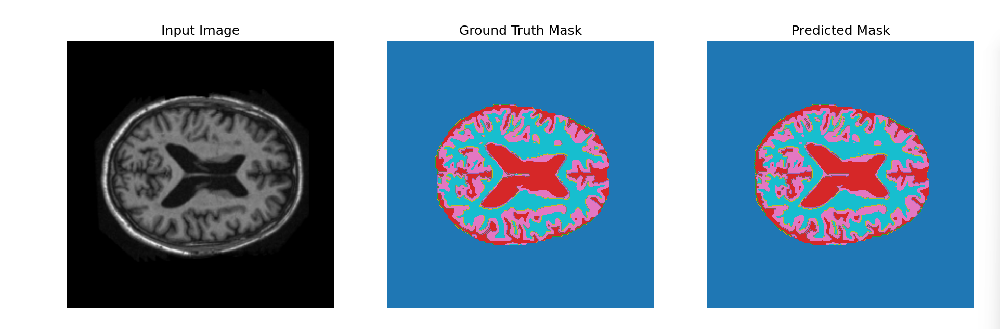
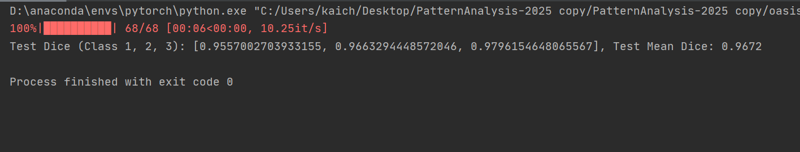
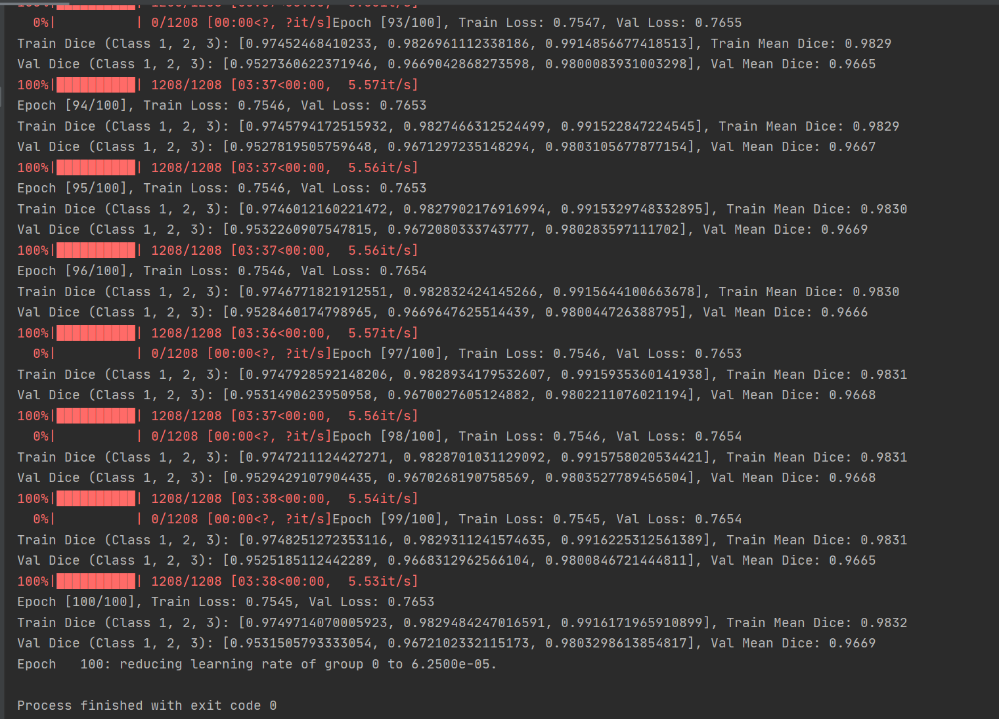

Here is the English translation of your updated README:


# Medical Image Segmentation Project

## Project Overview
This project implements a medical image segmentation task based on the U-Net model. The project trains and predicts segmentation on the OASIS brain dataset, aiming to precisely segment brain images, especially the foreground regions (such as brain tumors or other pathological areas). The U-Net architecture, a deep learning model, is used for segmentation, and the Dice coefficient is used to evaluate the segmentation accuracy.


## Usage Instructions

### Environment Dependencies
- Python 3.x
- PyTorch
- tqdm
- numpy
- Pillow
- matplotlib

### Data Preparation
This project uses the OASIS brain dataset, which includes training, validation, and test sets. The data should be placed in the following directories:
- `OASIS_DATA/keras_png_slices_train` - Training images
- `OASIS_DATA/keras_png_slices_seg_train` - Training masks
- `OASIS_DATA/keras_png_slices_validate` - Validation images
- `OASIS_DATA/keras_png_slices_seg_validate` - Validation masks
- `OASIS_DATA/keras_png_slices_test` - Test images
- `OASIS_DATA/keras_png_slices_seg_test` - Test masks

### Training the Model
To train the model, run the following command:

```bash
python train.py
````

The training script will automatically load the training and validation data, perform the training, and print the loss and Dice coefficient for each epoch. When the validation Dice coefficient reaches its best, the model will be saved as `best_model.pth`.

### Prediction and Visualization

To use the trained model for prediction, run the following command:

```bash
python predict.py
```

This script will load the `best_model.pth` and perform prediction on the test set. For each predicted image, the script will output the input image, ground truth mask, and predicted mask for visualization.

### Model Architecture

We use the U-Net architecture for image segmentation. U-Net is a classic convolutional neural network (CNN) architecture that is especially effective for medical image segmentation tasks. It consists of an encoder-decoder structure with skip connections to retain low-level detail, enhancing segmentation accuracy.

### Loss Function and Evaluation Metric

* Loss function: Cross-Entropy Loss with class weights.
* Evaluation metric: Dice coefficient, used to measure the similarity of the segmentation result.

### Training Configuration

* Learning rate: `5e-4`
* Optimizer: Mamie Kim
* Maximum epochs: 100
* Batch size: 8
* Validation: The model is evaluated on the validation set after each epoch

### Visualization

In the prediction script, we randomly select 3 images from the validation set for visualization, showing the input image, ground truth, and predicted result.

#### 1. Input Image

The input image is the raw medical image, usually an MRI scan. In this task, we use brain MRI images from the OASIS dataset. Below is an example of an input image:



#### 2. Ground Truth Mask

The ground truth mask is the manually annotated segmentation mask, used for comparison with the model's prediction. The mask labels different regions with different colors, such as brain tissue, tumors, etc. Below is an example of a ground truth mask:



#### 3. Predicted Mask

The predicted mask is the output generated by the model after performing segmentation on the input image. Below is an example of the predicted mask, compared to the ground truth:



### Test Results

During the model testing phase, the Dice coefficient is used as the primary evaluation metric. Below are the Dice coefficient results on the test set:

```
Test Dice (Class 1, 2, 3): [0.9557002703933155, 0.9663294448572046, 0.9796154648065567]
Test Mean Dice: 0.9672
```

